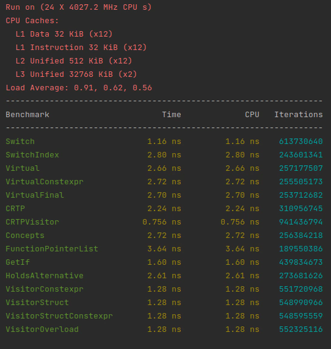
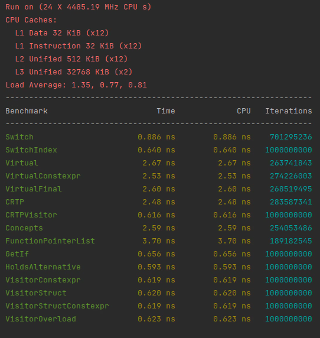

# A simple implementation of a state machine

## Design decisions
- Based on benchmark this implementation is based on the CRTP visitor pattern as it seem to be the fastest between LLVM 15 and GCC 12.1 (pictured). 

 


- Header only library
- No internal/external events, no pre/post transition actions, no explicit guards other than preventing invalid 
transitions (see examples).
- The initial state is implicitly defined with the first element in `states`.

TODO:
- handle leveraged markets (e.g. margin calls)

## Usage
Run benchmarks:
```shell
mkdir build && cd build
cmake ..
make all
./bin/benchmark_StaticPolymorphism
```
## Examples
In `example/OrderFSM.hpp` we show how to implement this state graph of an order with IOT, IOK, GTD and GTC.

